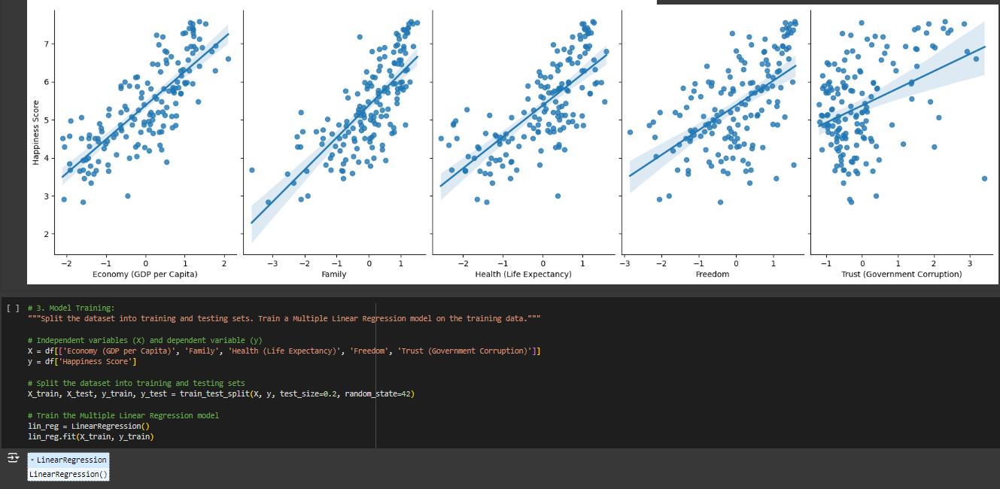

# Multiple Linear Regression - World Happiness Report Analysis

This project involves performing a Multiple Linear Regression analysis on the World Happiness Report dataset. The goal is to explore the relationships between various independent variables (such as GDP per capita, social support, life expectancy) and a dependent variable (happiness score) to understand what factors contribute most significantly to the happiness of a nation.

## Project Overview:
- **Dataset:** The dataset used in this project is derived from the World Happiness Report, which includes various metrics from different countries that contribute to happiness levels.
- **Independent Variables:** GDP per capita, social support, life expectancy, freedom to make life choices, generosity, perceptions of corruption.
- **Dependent Variable:** Happiness Score
- **Objective:** To determine the strength and significance of the relationship between these independent variables and the happiness score using Multiple Linear Regression.

## Features:
- **Data Preprocessing:** Clean the dataset, handle missing values, and prepare the data for analysis.
- **Exploratory Data Analysis (EDA):** Visualize and summarize the data to understand distributions, correlations, and trends.
- **Model Training:** Build and train a Multiple Linear Regression model to predict happiness scores based on the independent variables.
- **Model Evaluation:** Assess the model's performance using various metrics such as R-squared and Mean Squared Error (MSE).
- **Insights & Interpretation:** Interpret the coefficients of the regression model to understand the impact of each independent variable on happiness.

## Technology Stack
- **Programming Language:** Python.

## Screenshots

<div style="display: flex; gap: 10px;">
  
</div>

## Contributing
If you want to contribute to this project, feel free to open issues or submit pull requests. Your feedback and contributions are highly appreciated!

## Contact
For any questions or feedback, you can reach out to me at [Hissah.khalid@hotmail.com](mailto:Hissah.khalid@hotmail.com). 

## License
 ```bash
  Copyright 2024 Hissah Khalid.
